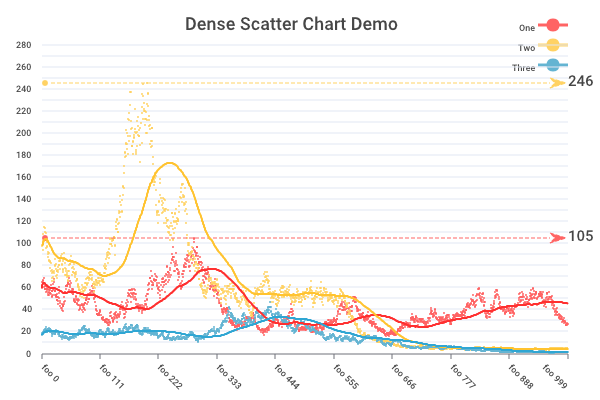

# go-analyze/charts

[](https://github.com/go-analyze/charts/blob/master/LICENSE)
[](https://github.com/go-analyze/charts/actions/workflows/tests-main.yml)

Our library focuses on generating beautiful charts and graphs within Go. Graphs are used to show a lot of different types of data, needing to be represented in a unique in order to convey the meaning behind the data. This Go module attempts to use sophisticated defaults to try and render this data in a simple way, while still offering intuitive options to update the graph rendering as you see fit.

## Functionality

Currently supported chart types: `line`, `scatter`, `bar`, `horizontal bar`, `pie`, `doughnut`, `radar`, `candlestick`, `funnel` and `table`.

New users should check out the [Features Overview](https://github.com/go-analyze/charts/wiki/Feature-Overview) on our Wiki to see commonly used features for each chart type, as well as linking to specific examples for the feature.

We also have an extensive [catalog of examples](./examples/). Reference the [README](./examples/README.md) within the `examples` directory to see a list of our example implementations of each chart type and configurations.

### Themes

Our library offers a wide range of themes, the examples below are only a small subset of what we offer. See our [Themes list in Feature Overview](https://github.com/go-analyze/charts/wiki/Feature-Overview#themes) to see our complete theme list.

<p align="center">
    
</p>

### Line Chart


Line Chart Feature List: https://github.com/go-analyze/charts/wiki/Feature-Overview#line-charts

```go
import (
	"github.com/go-analyze/charts"
)

func main() {
	// values specified where the first index is for each data series or source, and the second index is for each sample.
	values := [][]float64{
		{	// Email
			120, // Mon
			132, // Tue
			101, // Wed
			134, // Thu
			90,  // Fri
			230, // Sat
			210, // Sun
		},
		{
			// values for 'Search Engine' go here
		},
	}
	opt := charts.NewLineChartOptionWithData(values)
	opt.Title = charts.TitleOption{
		Text: "Line Chart Demo",
	}
	opt.XAxis.Labels = []string{
		// The 7 labels here match to the 7 values above
		"Mon", "Tue", "Wed", "Thu", "Fri", "Sat", "Sun",
	}
	opt.Legend = charts.LegendOption{
		SeriesNames: []string{
			"Email", "Search Engine",
		},
	}
	// other options as desired...

	p := charts.NewPainter(charts.PainterOptions{
		Width:        600,
		Height:       400,
	})
	err := p.LineChart(opt)
	// ... err check
	buf, err := p.Bytes()
	// ...
```

Top Line Chart Examples:
* [line_chart-1-basic](./examples/1-Painter/line_chart-1-basic) - Basic line chart with some simple styling changes and a demonstration of `null` values.
* [line_chart-2-symbols](./examples/1-Painter/line_chart-2-symbols) - Basic line chart which sets a different symbol for each series item.
* [line_chart-3-smooth](./examples/1-Painter/line_chart-3-smooth) - Basic line chart with thick smooth lines drawn.
* [line_chart-4-mark](./examples/1-Painter/line_chart-4-mark) - Line chart with included mark points and mark lines.
* [line_chart-6-stacked](./examples/1-Painter/line_chart-6-stacked) - Line chart with "Stacked" series enabled, making each series a layer on the chart and the top line showing the sum.
* [line_chart-8-dual_y_axis](./examples/1-Painter/line_chart-8-dual_y_axis) - Basic line chart with two series, one rendered to the left axis and one to a second y axis on the right.

### Scatter Chart



Scatter Chart Feature List: https://github.com/go-analyze/charts/wiki/Feature-Overview#scatter-charts

```go
import (
	"github.com/go-analyze/charts"
)

func main() {
	opt := charts.NewScatterChartOptionWithData([][]float64{
		{120, 132, 101, charts.GetNullValue(), 90, 230, 210},
		{ /* values for search engine go here */ },
	})
	opt.Title.Text = "Scatter"
	opt.XAxis.Labels = []string{
		// The 7 labels here match to the 7 values above
		"Mon", "Tue", "Wed", "Thu", "Fri", "Sat", "Sun",
	}
	opt.Legend.SeriesNames = []string{"Email", "Search Engine"}
	// set other field options as desired...

	p := charts.NewPainter(charts.PainterOptions{
		Width:        600,
		Height:       400,
	})
	err := p.ScatterChart(opt)
	// ... err check
	buf, err := p.Bytes()
	// ...
```

Top Scatter Chart Examples:
* [scatter_chart-1-basic](./examples/1-Painter/scatter_chart-1-basic) - Basic scatter chart with some simple styling changes and a demonstration of `null` values.
* [scatter_chart-3-dense_data](./examples/1-Painter/scatter_chart-3-dense_data) - Scatter chart with dense data, trend lines, and more custom styling configured.

### Bar Chart


Bar Chart Feature List: https://github.com/go-analyze/charts/wiki/Feature-Overview#bar-charts

```go
import (
	"github.com/go-analyze/charts"
)

func main() {
	// values specified where the first index is for each data series or source, and the second index is for each sample.
	values := [][]float64{
		{   // Rainfall data
			2.0, 4.9, 7.0, 23.2, 25.6, 76.7, 135.6, 162.2, 32.6, 20.0, 6.4, 3.3,
		},
		{
			// 'Evaporation' data goes here
		},
	}
	opt := charts.NewBarChartOptionWithData(values)
	opt.XAxis.Labels = []string{
		// A label for each position in the values above
		"Jan", "Feb", "Mar", "Apr", "May", "Jun", "Jul", "Aug", "Sep", "Oct", "Nov", "Dec",
	}
	opt.Legend = charts.LegendOption{
		SeriesNames: []string{
			"Rainfall", "Evaporation",
		},
		Offset:       charts.OffsetRight,
	}
	// Example of adding a mark line across the bars, or mark points for specific values
	opt.SeriesList[0].MarkLine.AddLines(charts.SeriesMarkTypeAverage)
	opt.SeriesList[0].MarkPoint.AddPoints(charts.SeriesMarkTypeMax, charts.SeriesMarkTypeMin)
	// other options as desired...

	p := charts.NewPainter(charts.PainterOptions{
		Width:        600,
		Height:       400,
	})
	err := p.BarChart(opt)
	// ... err check
	buf, err := p.Bytes()
	// ...
```

Top Bar Chart Examples:
* [bar_chart-1-basic](./examples/1-Painter/bar_chart-1-basic) - Basic bar chart.
* [bar_chart-4-mark](./examples/1-Painter/bar_chart-4-mark) - Bar chart with included mark points and mark lines.

### Horizontal Bar Chart


Horizontal Bar Chart Feature List: https://github.com/go-analyze/charts/wiki/Feature-Overview#horizontal-bar-charts

Top Horizontal Bar Chart Examples:
* [horizontal_bar_chart-1-basic](./examples/1-Painter/horizontal_bar_chart-1-basic) - Basic horizontal bar chart.

### Pie Chart


Pie Chart Feature List: https://github.com/go-analyze/charts/wiki/Feature-Overview#pie-charts

```go
import (
	"github.com/go-analyze/charts"
)

func main() {
	values := []float64{
		1048, // Search Engine
		735,  // Direct
		580,  // Email
		484,  // Union Ads
		300,  // Video Ads
	}
	opt := charts.NewPieChartOptionWithData(values)
	opt.Title = charts.TitleOption{
		Text:             "Pie Chart",
		Offset:           charts.OffsetCenter,
	}
	opt.Legend.SeriesNames = []string{
		"Search Engine", "Direct", "Email", "Union Ads", "Video Ads",
	}
	// other options as desired...

	p := charts.NewPainter(charts.PainterOptions{
		Width:        600,
		Height:       400,
	})
	err := p.PieChart(opt)
	// ... err check
	buf, err := p.Bytes()
	// ...
```

Top Pie Chart Examples:
* [pie_chart-1-basic](./examples/1-Painter/pie_chart-1-basic) - Pie chart with a variety of customization demonstrated including positioning the legend in the bottom right corner.
* [pie_chart-2-radius](./examples/1-Painter/pie_chart-2-radius) - Pie chart which varies the series radius by the percentage of the series.

### Doughnut Chart


Doughnut Chart Feature List: https://github.com/go-analyze/charts/wiki/Feature-Overview#doughnut-charts

Top Radar Chart Examples:
* [doughnut_chart-1-basic](./examples/1-Painter/doughnut_chart-1-basic) - Basic doughnut chart.
* [doughnut_chart-2-styles](./examples/1-Painter/doughnut_chart-2-styles) - A variety of styles shown for doughnut charts.

### Radar Chart


Radar Chart Feature List: https://github.com/go-analyze/charts/wiki/Feature-Overview#radar-charts

Top Radar Chart Examples:
* [radar_chart-1-basic](./examples/1-Painter/radar_chart-1-basic) - Basic radar chart.

### Heat Map Chart


Heat Map Chart Feature List: https://github.com/go-analyze/charts/wiki/Feature-Overview#heat-map-charts

Top Radar Chart Examples:
* [heat_map-1-basic](./examples/1-Painter/heat_map-1-basic) - Basic heat map chart.

### Table


Table Feature List: https://github.com/go-analyze/charts/wiki/Feature-Overview#tables

Top Table Examples:
* [table-1](./examples/1-Painter/table-1) - Table with a variety of table specific configuration and styling demonstrated.

### Candlestick Chart


Candlestick Chart Feature List: https://github.com/go-analyze/charts/wiki/Feature-Overview#candlestick-charts

```go
import (
	"github.com/go-analyze/charts"
)

func main() {
	ohlcData := []charts.OHLCData{
		{Open: 100.0, High: 110.0, Low: 95.0, Close: 105.0},
		{Open: 105.0, High: 115.0, Low: 100.0, Close: 112.0},
		{Open: 112.0, High: 118.0, Low: 108.0, Close: 115.0},
		// ... more OHLC data
	}

	opt := charts.NewCandlestickOptionWithData(ohlcData)
	opt.Title.Text = "Candlestick Chart"
	opt.XAxis.Labels = []string{
		"Day 1", "Day 2", "Day 3", // ... matching data points
	}

	p := charts.NewPainter(charts.PainterOptions{
		Width:  800,
		Height: 600,
	})
	err := p.CandlestickChart(opt)
	// ... err check
	buf, err := p.Bytes()
	// ...
```

Top Candlestick Chart Examples:
* [candlestick_chart-1-basic](./examples/1-Painter/candlestick_chart-1-basic) - Basic OHLC data visualization with a candlestick chart.
* [candlestick_chart-4-patterns](./examples/1-Painter/candlestick_chart-4-patterns) - Automatic pattern detection.
* [candlestick_chart-5-aggregation](./examples/1-Painter/candlestick_chart-5-aggregation) - Time-based aggregation of candlestick data.

### Funnel Chart

Funnel Chart Feature List: https://github.com/go-analyze/charts/wiki/Feature-Overview#funnel-charts

```go
import (
	"github.com/go-analyze/charts"
)

func main() {
	values := []float64{
		100, // Show
		80,  // Click
		60,  // Visit
		40,  // Inquiry
		20,  // Order
	}
	opt := charts.NewFunnelChartOptionWithData(values)
	opt.Title.Text = "Funnel Chart"
	opt.Legend.SeriesNames = []string{
		"Show", "Click", "Visit", "Inquiry", "Order",
	}

	p := charts.NewPainter(charts.PainterOptions{
		Width:        600,
		Height:       400,
	})
	err := p.FunnelChart(opt)
	// ... err check
	buf, err := p.Bytes()
```

Top Funnel Chart Examples:
* [funnel_chart-1-basic](./examples/1-Painter/funnel_chart-1-basic) - Basic funnel chart.

### ECharts Render

```go
import (
	"github.com/go-analyze/charts"
)

func main() {
	buf, err := charts.RenderEChartsToPNG(`{
		"title": {
			"text": "Line Chart"
		},
		"xAxis": {
			"data": ["Mon", "Tue", "Wed", "Thu", "Fri", "Sat", "Sun"]
		},
		"series": [
			{
				"data": [150, 230, 224, 218, 135, 147, 260]
			}
		]
	}`)
	// snip...
```

## Current Project Status

Forked from [vicanso/go-charts](https://github.com/vicanso/go-charts) and the archived [wcharczuk/go-chart](https://github.com/wcharczuk/go-chart), our project introduces enhancements for rendering challenging datasets. We aim to build upon their solid foundation to offer a more versatile and user-friendly charting solution.

### API Stability

We're committed to refining the API, incorporating feedback and new ideas to enhance flexibility and ease of use.

Until the `v1.0.0` release, API changes should be anticipated. We detail needed API changes on our wiki [Version Migration Guide](https://github.com/go-analyze/charts/wiki/Version-Migration-Guide).

### Changes

Notable improvements in our fork include:

* **Expanded Features:** We continue to develop and extend this library. Recent additions include scatter charts with trend lines, a wide range of built-in themes, stacked series, improved support for eCharts configurations, and smooth line rendering.
* **Intuitive Configuration:** Our goal is to ensure configuration options are clear and easy to use. In addition to refining the Go API, we have expanded our documentation in both [GoDocs](https://pkg.go.dev/github.com/go-analyze/charts) and the [Wiki](https://github.com/go-analyze/charts/wiki).
* **Expanded Testing:** We are committed to comprehensive test coverage. Increased test coverage has led to significant bug fixes, ensuring better reliability across a wide range of configurations.

Our library is an evolving project, aiming to become a standout choice for Go developers seeking powerful yet easy-to-use charting tools. We welcome contributions and feedback as we continue to enhance our library's functionality, configurability, and reliability.

### `wcharczuk/go-chart` Changes

If you're migrating from `wcharczuk/go-chart`, you should be able to migrate with minimal modifications. The `wcharczuk/go-chart` codebase has been integrated into our `chartdraw` package. Any necessary changes are documented in our [wcharczuk/go‐chart Migration Guide](https://github.com/go-analyze/charts/wiki/wcharczuk-go%E2%80%90chart-Migration-Guide).
